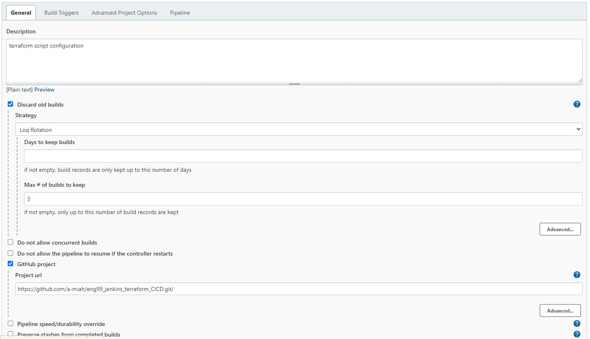
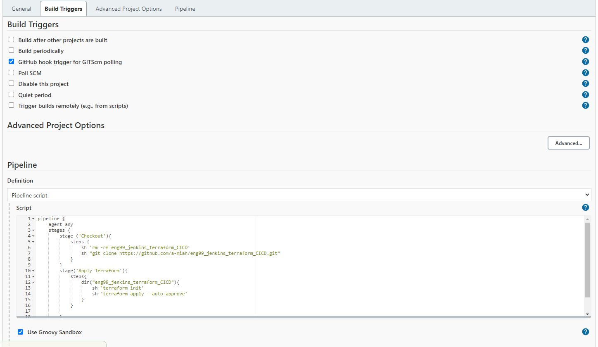

# Automate IaC with Terraform and Ansible

## Building Jenkins Server

1. Launch EC2 instance on AWS
2. SSH into on bash


## Install Java on Jenkins EC2 Server
- https://www.digitalocean.com/community/tutorials/how-to-install-java-with-apt-on-ubuntu-18-04#installing-specific-versions-of-openjdk

3. Install below java dependencies

```
sudo apt update
sudo apt install default-jre
java --version
sudo apt install default-jdk
javac --version
```

## Installing Jenkins
- https://www.digitalocean.com/community/tutorials/how-to-install-jenkins-on-ubuntu-18-04

4. Run following code to install dependencies:

```
wget -q -O - https://pkg.jenkins.io/debian-stable/jenkins.io.key | sudo apt-key add -
sudo sh -c 'echo deb http://pkg.jenkins.io/debian-stable binary/ > /etc/apt/sources.list.d/jenkins.list'
sudo apt update
sudo apt install jenkins
sudo systemctl start jenkins
sudo systemctl status jenkins
sudo ufw allow 8080  #opens port 8080
sudo ufw status

```

5. If firewall is inactive run below code 

```
sudo ufw allow OpenSSH
sudo ufw enable
```
6. Go to http://your_server_ip_or_domain:8080 on browser
7. Admin password - `sudo cat /var/lib/jenkins/secrets/initialAdminPassword`
8. Continue with account setup and install suggested plugins 


## Terraform in Jenkins 

### Install Terraform plugin
- Dashboard > Manage jenkins > Manage plugins > Terraform 

### Downloading Terraform on Jenkins Instance 
1.  Download Terraform for Linux - https://www.terraform.io/downloads
2.  Use following commands:
```
- wget https://releases.hashicorp.com/terraform/1.1.3/terraform_1.1.3_linux_amd64.zip
- sudo apt install unzip
- sudo unzip terraform_1.1.3_linux_amd64.zip
- sudo mv terraform /usr/bin
- terraform --version
```
3. Dashboard > Manage Jenkins > Global Tool Configuration > Terraform > Add Terraform
4. Configure
```
Name: Terraform
Install directory: /usr/bin/
```

### IaC using Terraform 
- Look at main.tf for script on creating VPC and EC2 Instances

### Configuring Environment Variables
- AWS_ACCESS_KEY_ID
- AWS_SECRET_ACCESS_KEY
- AWS_DEFAULT_REGION = eu-west-1

### Create new jenkins job 
- Pick pipeline instead of freestyle
- Configure job as below:





### Code in Pipeline script 

```
pipeline {
    agent any
    stages {
        stage ('Checkout'){
            steps {
                sh 'rm -rf eng99_jenkins_terraform_CICD'
                sh "git clone https://github.com/a-miah/eng99_jenkins_terraform_CICD.git"
            }
        }
        stage('Apply Terraform'){
            steps{
                dir("eng99_jenkins_terraform_CICD"){
                    sh 'terraform init'
                    sh 'terraform apply --auto-approve'
                }
            }
            
        }
        
    }
}
```

## Creating Webhook

### Creating public and private keys
- In git bash --> `cd .ssh`
- Create a public and private key --> `ssh-keygen -t rsa -b 4096 -C "<email_address>"`
- Name the keys
- Github repo > Settings > Deploy keys > Add key > Copy public key into github

### Adding Webhook
- Github repo > Settings > Webhooks > Add
- Config as below and create
```
Payload URL: http://<jenkins_server_ip>:8080/github-webhook/
Content type: application/json
Events to trigger: send me everything
Active: select
```


## Ansible Playbooks

### Installing Ansible
1. Install Ansible plugin on Jenkins from Dashboard > Manage plugins
2. Install Ansible on Jenkins server EC2 instance after ssh using following commands:
```
sudo apt-get update -y
sudo apt-get udgrade -y
sudo apt-get install software-properties-common 
sudo apt-add-repository ppa:ansible/ansible
sudo apt-get update
sudo apt-get install ansible

```
3. In Global Tool Configuration add ansible and path using below:
```
Name: Ansible
Path directory: /usr/bin/
```
- This will allow you to use jenkins jobs. Path can be found by running which ansible in ec2 instance

### MongoDB playbook
1. Create a .yml file to configure database: `sudo nano install_mongo.yml`

```
# Installing mongo in db VM
---
# host name
- hosts: db
 gather_facts: yes

# gather facts for installation

# we need admin access
 become: true

# The actual task is to install mongodb in db VM

 tasks:
 - name:
   shell: |
     sudo apt-get update -y
     sudo apt-get upgrade -y
     
 - name: Installing mongodb in db VM
   apt: pkg=mongodb state=present

 - name: restarting db and chnaging conf file
   shell: |
     rm -rf /etc/mongod.conf
     cp ./mongod.conf /etc/mongod.conf
     sudo systemctl restart mongodb
     sudo systemctl enable mongodb
   become_user: root

```

2. Create a host file: 

```
[db]
ec2-instance ansible_host=<EC2 Instance IP> ansible_user=ubuntu

[app]
ec2-instance ansible_host=<EC2 instance IP> ansible_user=ubuntu
```

3. Create a new jenkins job with the following pipeline script:

```
pipeline {
    agent any
    stages {
        stage ('Get Filles'){
            steps {
                sh 'rm -rf eng99_jenkins_terraform_CICD'
                sh "git clone https://github.com/a-miah/eng99_jenkins_terraform_CICD.git"
            }
        }
        stage('Execute Ansible plaaybook'){
            steps{
                dir("eng99_jenkins_terraform_CICD"){
                    ansiblePlaybook credentialsId: '', disableHostKeyChecking: true, installation: 'Ansible', inventory: 'hosts.inv', playbook: 'install_mongodb.yml'
                }
            }
            
        }
        
    }
} 
```

### Playbook for App